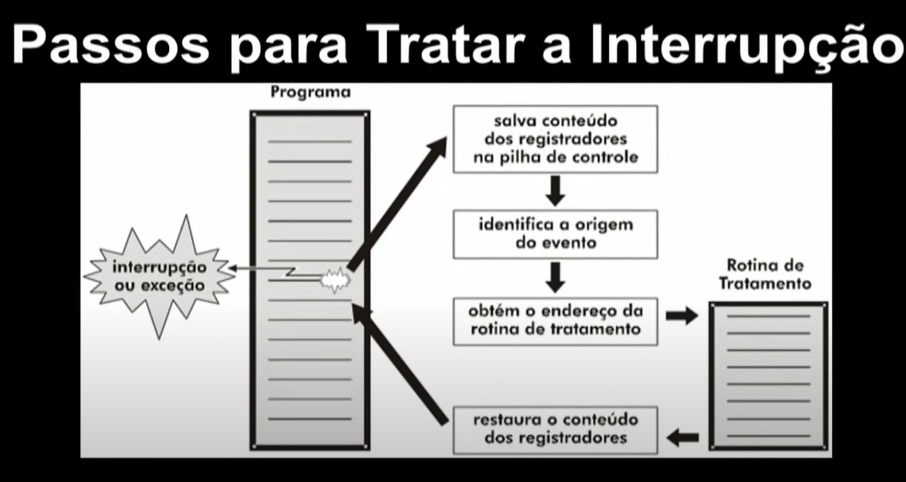

# Chamada de sistema e interrupcao

## Chamadas de sistemas

Se uma aplicação precisa realizar alguma instrução privilegiada (**imprimir um arquivo**),ela realiza uma chamada de sistema, que altera do modo usuário para o **modo kernel**;

Ex.: Ler um arquivo.

Chamadas de sistema são a porta de entrada para o **modo kernel**;

## Como são realizadas ?

1. As chamadas de sistemas são realizadas através de intruções **Traps**.
2. Traps são conhecidos como interrupções de software.
3. Após o término da chamada, a execução continua após a chamada de sistema

## Passos p/ chamada de sistema

1. Aplicativo faz chamada ao sistema (Trap).
2. Através de uma tabela, o endereço da rotina.
3. Rotina de serviço é acionada (rotina compartilhada).
4. Serviço solicitado é executado e o controle retorna ao aplicativo.

## Interface das SysCalls

 - Interface para esconder a complexidade das SysCalls
 - Interface de programação fornecida pelo SO.
 - Geralmente escrita em liguagem de alto nível (C, C++ ou Java).
 - Normalmente as aplicações utilizam uma Aplicattion Program Interface (API).
 - Interface que encapsula o acesso direto ás chamadas ao sistema.

## Exemplo de uso com o *printf()*

Programa C que invoca a função de biblioteca print(), que por sua vez chamaa o system call **write(  )**. A chamada **printf(  )** ocasiona a chamada **write(  )** e **exit(  )**
## Interrupções

Vimos que um software pode interromper seu próprio processo (Ao fazer uma chamada de sistema):

1. Usando **traps** (interrupções de software ou Exceções).
2. Para isso, a aplixação tem que estar rodando.

Mas ocorrem **interrupções que não são causadas por aplicações em execução**:

1. Interrupções de hardware (eventos externos).
2. Um sinal elétrico no hardware.
3. Causa: dispositivo de E/S ou o clock.

## Passos para tratar uma interrupção

## Interrupção VS Traps

### Interrupção

 - Evento externo ao processador.
 - Gerada por dispositivos que precisam da atenção do SO.
 - Pode não estar relacionada ao processo que está rolando.

### Traps

 - Evento inesperado vindo de dentro do processador.
 - Causados pelo processo corrente no processador (seja por chamada ao SO, seja por instrução ilegal)

